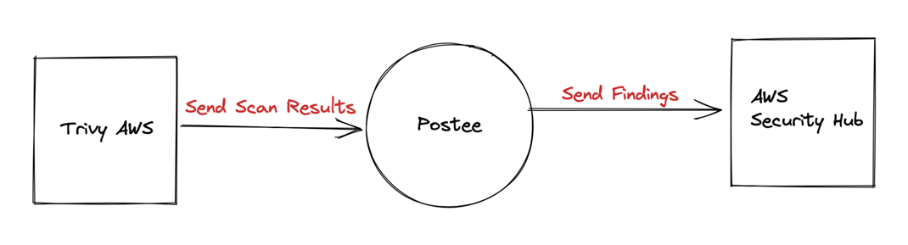

# Tunnel AWS CSPM Scanning

## Introduction
In this walkthrough, we will setup AWS Cloud Scanning with [Tunnel](https://github.com/khulnasoft/tunnel) and send the results to Hooker, which in turn will send the results to [AWS Security Hub](https://aws.amazon.com/security-hub/), a CSPM product by AWS.

## Scenario
A DevOps team would like to configure alerts for their Cloud Security Posture in order to know if they are following the best security practices. This is especially important in those scenarios where compliance can fall out of place during active usage. For this they decide to install Tunnel, and use the [AWS Scanning feature](https://www.youtube.com/watch?v=XGfr-9CawV0) to send the results to Hooker.

They decide to configure Hooker so that upon receiving such alerts, Hooker can action upon them as desired but also report them upstream to the AWS Security Hub for further analysis and triage.



## Sample Configs
In this case a sample configuration for the components can be described as follows:

### Hooker Config

Hooker Actions dispatches calls via the HTTP Action to 3 different AWS Lambda URLs. These requests are performed in parallel. In addition, the operator is performed of the trigger and notified via a Slack message.

```yaml
actions:
- type: awssecurityhub
  enable: true
  name: Send Findings to Security Hub
routes:
- name: Send Tunnel Findings to AWS Security Hub
  template: raw-json
  actions:
  - Send Findings to Security Hub
  input-files:
  - Tunnel AWS Findings
templates:
- name: raw-json
  rego-package: hooker.rawmessage.json
rules:
- name: Tunnel AWS Findings
name: Send Tunnel Results to AWS Security Hub
```

!!! note
    Currently Hooker AWS Security Hub configuration only supports reading AWS Credentials from the AWS config file present on disk.

### AWS Security Hub configuration
AWS Security Hub can be configured using the instructions as defined [here](https://docs.aws.amazon.com/securityhub/latest/userguide/securityhub-settingup.html)

!!! tip
    AWS Security Hub only accepts Tunnel findings from the AWS account that is associated with the findings. The identifier of the associated account is the value of the AwsAccountId attribute for the finding.

### Tunnel Webhook Plugin
[Tunnel Webhook Plugin](https://github.com/khulnasoft/tunnel-plugin-webhook) is a Tunnel plugin that lets you send Tunnel scan results to a webhook listening on an endpoint. In this case we can make use of it as follows:

#### Install the plugin
```shell
tunnel plugin install github.com/khulnasoft/tunnel-plugin-webhook
```

#### Run the Tunnel scan using the plugin
```shell
tunnel webhook -- --url=<hooker-endpoint> -- <tunnel args>
```